# Chapter 2: Architecture Panorama and Core Design Philosophy

## 2.1 Layered Architecture

```
┌─────────────────────────────────────────────────────────────┐
│                       User Layer                            │
│   CLI (oh)  |  TUI (React + Ink)  |  API (REST/OpenAI)     │
└─────────────────────────────────────────────────────────────┘
                              │
┌─────────────────────────────────────────────────────────────┐
│                  Commands Layer (54 commands)               │
│  /help /plan /commit /resume /cron /agent ...             │
└─────────────────────────────────────────────────────────────┘
                              │
┌─────────────────────────────────────────────────────────────┐
│           Coordination Layer (Coordinator + Swarm)         │
│  • Agent definition & lifecycle management (975 lines)    │
│  • Multi-agent team formation (4,899 lines swarm module) │
│  • Sub-agent spawn & task distribution                   │
└─────────────────────────────────────────────────────────────┘
                              │
┌─────────────────────────────────────────────────────────────┐
│                Agent Loop (Engine)                         │
│  • Query loop: query → stream → tool-call → repeat       │
│                (666 lines)                                │
│  • Auto context compression                               │
│  • Parallel tool execution (async gather)                │
└─────────────────────────────────────────────────────────────┘
                              │
┌─────────────────────────────────────────────────────────────┐
│                 Capabilities Layer                         │
│  ├─ Tools system (2,542 lines, 43 tools)                  │
│  ├─ Skills knowledge base (on-demand .md loading)        │
│  ├─ Plugins mechanism (Anthropic compatible)             │
│  ├─ Hooks lifecycle (Pre/Post Tool Use)                  │
│  └─ Memory persistence (MEMORY.md + CLAUDE.md)           │
└─────────────────────────────────────────────────────────────┘
                              │
┌─────────────────────────────────────────────────────────────┐
│                 Channel Layer (Channels)                   │
│  • Feishu(945), DingTalk, WeCom, Telegram, Discord...    │
│  • Unified abstraction for IM message receive/send       │
└─────────────────────────────────────────────────────────────┘
                              │
┌─────────────────────────────────────────────────────────────┐
│               Infrastructure Layer                        │
│  • Permissions sandbox (145 lines)                        │
│  • Config system (362 lines)                              │
│  • Services: Cron scheduler, LSP support, OAuth, compact │
│  • MCP protocol client (340 lines)                        │
└─────────────────────────────────────────────────────────────┘
                              │
┌─────────────────────────────────────────────────────────────┐
│              Model & API Layer                             │
│  • OpenAI compatible client (342 lines)                   │
│  • Copilot OAuth (244 lines)                              │
│  • Multi-provider routing (Anthropic, DashScope, Ollama...)│
└─────────────────────────────────────────────────────────────┘
```

### Full Architecture Diagram (Mermaid)

```mermaid
flowchart TB
    subgraph USER["👤 User Layer"]
        CLI["CLI (oh)"]
        TUI["TUI (React + Ink)"]
        API["REST API (OpenAI compatible)"]
    end
    subgraph CMDS["📋 Commands Layer (54 commands)"]
        C1["/help, /plan"]
        C2["/commit, /resume"]
        C3["/cron, /agent ..."]
    end
    subgraph COORD["🎯 Coordination Layer"]
        COORDINATOR["Coordinator (975 lines)"]
        SWARM["Swarm Cluster (4,899 lines)"]
        SPAWN["Sub-agent Spawn & Distribution"]
    end
    subgraph ENGINE["🔄 Agent Loop (666 lines)"]
        QUERY["run_query()"]
        COMPACT["Auto-Compact"]
        PARALLEL["Parallel Tool Execution"]
    end
    subgraph CAPS["🧩 Capabilities Layer"]
        TOOLS["Tools (43 tools)"]
        SKILLS["Skills Knowledge Base"]
        PLUGINS["Plugins"]
        HOOKS["Hooks Lifecycle"]
        MEMORY["Memory Persistence"]
    end
    subgraph CHAN["📡 Channel Layer (13 platforms, 5,183 lines)"]
        F["Feishu(945)"]
        D["DingTalk(445)"]
        T["Telegram(509)"]
        O["10 other platforms"]
    end
    subgraph INFRA["⚙️ Infrastructure Layer"]
        PERM["Permissions Sandbox (145 lines)"]
        CFG["Config (362 lines)"]
        SVC["Cron/LSP/OAuth/compact"]
        MCP["MCP Protocol (340 lines)"]
    end
    subgraph MODELS["🤖 Model & API Layer (342 lines)"]
        OAI["OpenAI Compatible Client"]
        AUTH["Copilot OAuth (244 lines)"]
        MULTI["Multi-provider Routing"]
    end
    USER --> CMDS --> COORD --> ENGINE --> CAPS --> CHAN --> INFRA --> MODELS
    classDef layer fill:#f0f4ff,stroke:#3366cc,stroke-width:2px
    class USER,CMDS,COORD,ENGINE,CAPS,CHAN,INFRA,MODELS layer
```





**Total**: 26,666 lines, 194 files, across 28 sub-modules

---

## 2.2 Design Philosophy

### Core Principle 1: Model Provides Intelligence, Harness Provides Hands, Eyes, Memory, Boundaries

- **Model**: Only responsible for reasoning and decision-making (LLM)
- **Harness**: Provides tool access, state management, security sandbox, persistence storage
- **Separation of concerns**: Model strategy can change (Claude↔GPT↔Kimi) while framework capabilities remain stable

### Core Principle 2: Minimal Core + Pluggable Extensions

- **Core loop** (`engine/query.py`): Only 666 lines, does exactly three things:
  1. Call LLM
  2. Execute tools
  3. Repeat until no tool requests

- **Tool system**: 43 tools can be independently loaded/unloaded, supports runtime registration
- **Plugin mechanism**: Compatible with Skills (`.md` knowledge bases) and Plugins (Claude Code extension format)

### Core Principle 3: Enterprise-Grade Security by Default

- **Permission model**: Three-tier default deny:
  1. Filesystem sandbox (optional whitelist)
  2. Shell command rejection list (dangerous commands like `rm -rf /`)
  3. User confirmation prompt (permission_prompt callback)

- **Memory isolation**: Each Agent has independent cwd, cannot cross paths by default

### Core Principle 4: Context Management is a Core Problem

- **CLAUDE.md auto-discovery**: Traverse upward from cwd to find CLAUDE.md at root and inject it
- **MEMORY.md persistence**: Cross-session memory stored in local files
- **Auto-Compact**: Automatically compress conversation history when approaching context window (LLM summary)

---

## 2.3 Data Flow: Full Journey of a User Query

```
User input "List src directory and count lines of code"
    │
    ▼
[Commands] → If /plan or other command, separate parsing path; otherwise enter Agent Loop
    │
    ▼
[Engine.run_query]
    ├─ auto_compact_if_needed()  # Check if context compression needed
    ├─ api_client.stream_message()  # Call LLM (streaming)
    │    └─ Model returns: {"text": "", "tool_uses": [{"name":"Bash","input":...}]}
    ├─ yield AssistantTextDelta("...")  # Streaming output
    └─ if tool_uses:
         ├─ permission_checker.evaluate()  # Permission check
         ├─ tool_registry.get(tool_name).execute()  # Execute tool
         │    └─ e.g., Bash: subprocess.run(command, cwd=context.cwd)
         ├─ append ToolResultBlock to messages
         └─ Continue next loop iteration (max turns=200)
    │
    ▼
Final output: AssistantTurnComplete + UsageSnapshot (token statistics)
```

---

## 2.4 Key Technical Decisions

### 1. Why asyncio instead of thread pool?

OpenHarness tool calls have lots of network I/O (WebFetch, MCP, API calls), asyncio fits better:

```python
# engine/query.py:145
results = await asyncio.gather(*[_run(tc) for tool_calls])
```

Parallel tool execution significantly reduces total latency.

### 2. Why React TUI instead of curses?

- **Ecosystem**: Ink + React component pattern, easier for frontend developers
- **Rich UI**: Supports animations, colors, layouts
- **Testable**: React testing toolchain is mature

But requires Node.js environment and extra frontend build.

### 3. Why separate `channels/impl`?

IM channels differ greatly (DingTalk, Feishu APIs completely different), but abstract interface is consistent:

```python
class Channel(Protocol):
    async def send(self, message: str, **kwargs): ...
    async def listen(self) -> AsyncIterator[ChannelEvent]: ...
```

Makes future platform expansion easier.

---

## 2.5 Comparison with OpenClaw (Preview)

| Dimension | OpenHarness | OpenClaw |
|-----------|-------------|----------|
| Core Loop | Pure asyncio + generator (query.py) | Node.js Event Loop |
| Language | Python (26k lines) | TypeScript/Node (~50k+ estimated) |
| TUI | React/Terminal (Ink) | Web-based Control UI |
| Plugins | Standardized skills + plugin interface | Custom skill system |
| Channels | 8+ platforms (Feishu, etc.) | Feishu + Telegram (extendable) |
| Security | Three-tier (files/commands/confirmation) | Path whitelist + command rejection |

**OpenClaw Advantages:**
- Deep OpenViking integration (vector memory)
- More mature enterprise deployment solution
- Web console more user-friendly

**OpenHarness Advantages:**
- Single Python environment, no Node.js + Python hybrid
- Academic project, cleaner code organization
- More comprehensive coverage of Chinese local platforms (Feishu, DingTalk, WeCom)

---

**Chapter Summary**: Clear architecture, well-defined layers, highly extensible. Next chapter: Chapter 3 — line-by-line source analysis of the Engine core loop.

**Next chapter** will walk through the 666-line implementation of `engine/query.py`.