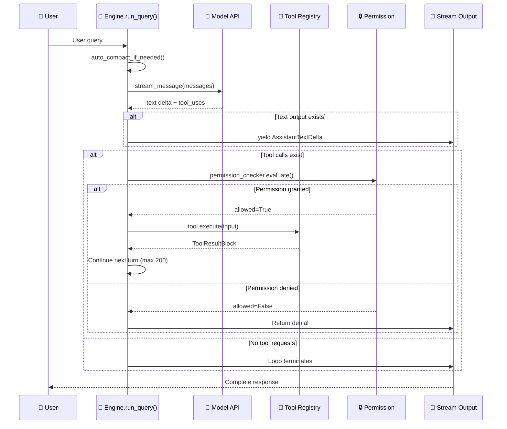

# Chapter 3: Engine Core Loop — Wisdom in 666 Lines

**Core File**: `src/openharness/engine/query.py` (6 files, 666 lines)

> 💡 **Why is the core loop only 666 lines?**
>
> Because an Agent's essence is simple: ask model → execute tool → ask model again → loop.
>
> What's complex are the tools, permissions, memory, channels — not the loop itself.

---

## 3.1 Entry Function: run_query

```python
async def run_query(
    context: QueryContext,
    messages: list[ConversationMessage],
) -> AsyncIterator[tuple[StreamEvent, UsageSnapshot | None]]:
```

### Parameter Breakdown

| Parameter | Type | Meaning |
|-----------|------|---------|
| `context` | QueryContext | Runtime context containing all dependencies |
| `messages` | list[ConversationMessage] | Conversation history (user input + assistant replies + tool results) |
| Return | AsyncIterator | Async stream — each event yields immediately, frontend can update in real-time |

### What's Inside QueryContext?

| Field | Purpose |
|-------|---------|
| `api_client` | Model interface (calls LLM) |
| `tool_registry` | Tool registry (looks up tools) |
| `permission_checker` | Permission checker (approval gate) |
| `hook_executor` | Hook executor (interceptor) |
| `cwd` | Working directory (filesystem isolation) |
| `max_turns` | Maximum turns (default 200) |

---

## 3.2 Loop Skeleton (Pseudo-code, 180 Core Lines)



This is the most critical part of the entire book — understanding it means understanding the whole framework:

```
for turn in range(max_turns):  # Max 200 turns
    │
    ├── Step 1: Check if context about to overflow
    │   auto_compact_if_needed()
    │   → Exceeds 80% of model window? Compress old messages
    │
    ├── Step 2: Call LLM (streaming)
    │   async for event in api_client.stream_message(messages):
    │       yield AssistantTextDelta("each character")  ← Frontend real-time display
    │   Finally get final_message (with text + tool_uses)
    │
    ├── Step 3: Does model still need to call tools?
    │   if not final_message.tool_uses:
    │       return  ← Done, conversation ends
    │
    ├── Step 4: Execute tools
    │   if only 1 tool:
    │       result = await execute_tool()  ← Serial
    │   else:
    │       results = await asyncio.gather(...)  ← Parallel! ⚡
    │
    └── Step 5: Append tool results to messages, next iteration
        messages.append(ToolResultBlock(...))

raise MaxTurnsExceeded("Exceeded 200 turns")
```

### Design Highlights

**① Parallel execution** — When model calls 3 tools simultaneously, not serial wait but `asyncio.gather` all together:

```python
results = await asyncio.gather(*[_run(tc) for tc in tool_calls])
```

> Example: Agent reads file, searches web, queries database → three I/O in parallel → total time = slowest one, not sum of all three.

**② Streaming output** — Not waiting for complete generation before returning, but yielding while generating:

```python
async for event in api_client.stream_message(...):
    yield AssistantTextDelta(event.text_delta)
```

> UX: Text appears character by character just like ChatGPT. No 10-second blank wait.

**③ Auto-compaction** — When conversation approaches context window limit, automatically compress old messages:

```python
messages, compacted = await auto_compact_if_needed(messages, context)
```

---

## 3.3 Permission Check: Every Tool Goes Through Security

Before tool execution, **every single tool_use gets permission checked** (not just once):

```python
# engine/query.py Line ~200
decision = context.permission_checker.evaluate(
    tool_name=tool_name,
    is_read_only=tool.is_read_only,
    file_path=input.get("path"),
    command=input.get("command"),
)

if not decision.allowed:
    return ToolResultBlock(content=decision.reason, is_error=True)

if decision.requires_confirmation:
    confirmed = await context.permission_prompt(decision.reason)
    if not confirmed:
        return ToolResultBlock(content="User denied this operation", is_error=True)
```

Decision tree:

```
permission_checker.evaluate()
    │
    ├── allowed=True → Execute immediately
    │
    ├── allowed=False, requires_confirmation=False → Deny directly ❌
    │
    └── allowed=False, requires_confirmation=True → Popup ask user
            ├── User confirms → Execute
            └── User denies → ToolResultBlock(is_error=True)
```

Detailed permission logic in [Chapter 5: Permission System](05-permissions.md).

---

## 3.4 Hooks: Interceptors Before/After Tool Execution

```python
# Before tool execution
if context.hook_executor:
    pre_hooks = await context.hook_executor.execute(
        HookEvent.PRE_TOOL_USE,
        {"tool_name": tool_name, "tool_input": tool_input, ...}
    )
    if pre_hooks.blocked:
        return ToolResultBlock(content=pre_hooks.reason, is_error=True)

# → Execute tool ←

# After tool execution
if context.hook_executor:
    await context.hook_executor.execute(
        HookEvent.POST_TOOL_USE,
        {"tool_name": tool_name, "tool_result": result, ...}
    )
```

**Enterprise use cases**:

| Hook Point | What Can Be Done |
|------------|------------------|
| PRE_TOOL_USE | Audit logging, rate limiting, additional approval |
| POST_TOOL_USE | Metrics collection, result validation, trigger downstream workflows |

---

## 3.5 Auto-Context Compaction

What if conversation gets too long? Two strategies:

| Strategy | Approach | LLM Call | Cost |
|----------|----------|----------|------|
| **Micro-Compact** | Clear old tool_result content, replace with placeholder text | ❌ Not needed | Zero |
| **Full Compact** | Call LLM to generate "summary of this conversation", replace old message list | ✅ Required | Few cents |

**Trigger condition**:

```python
if estimated_tokens > model_context_window * 0.8:
    # Exceeds 80% of window → start compaction
```

**Safety protections**:
- Only clears tool_result content, never discards conversation intent
- Always keeps last 5 complete messages (prevents losing critical context)
- Full Compact can use smaller model (saves money)

### How is Token Estimation Done?

```python
def estimate_tokens(text: str) -> int:
    return len(text) // 4 * 1.33  # char count / 4, plus 33% buffer
```

Crude but sufficient — precise tokenizer too slow, not worth it.

---

## 3.6 Exception Handling and Edge Cases

| Scenario | Behavior |
|----------|----------|
| Model returns empty response | Continue next turn (no error) |
| Tool execution throws exception | ToolResultBlock(is_error=True) → tell model |
| Exceeds max_turns | raise MaxTurnsExceeded → entire query fails |
| Network timeout | Retry or return error, depends on api_client implementation |
| Permission denied | ToolResultBlock → model knows "denied" |

**Key design**: Tool errors don't break the loop; instead converted to ToolResultBlock telling the model. Model can self-adjust and retry.

---

## 3.7 Comparison with OpenClaw's Engine

| Comparison | OpenHarness | OpenClaw |
|------------|-------------|----------|
| **Loop structure** | Python async generator (yield event stream) | Node.js stream + async/await |
| **Context compression** | Two-level (micro + full) | OpenViking vector recall compression |
| **Parallel tools** | `asyncio.gather` (native) | `Promise.all` (similar) |
| **Hook points** | PRE/POST_TOOL_USE | preTool / postTool |
| **Code size** | **666 lines** (concentrated in query.py) | ~1.5K+ lines (more distributed) |
| **Error handling** | ToolResultBlock(is_error=True) → model self-adapt | Similar but more gateway-dependent |

**OpenHarness advantages**:
- More compact code, decision logic at a glance
- Python generator naturally elegant for streaming loops

**OpenClaw advantages**:
- OpenViking vector compression smarter (semantic-level, not just summary)
- Node.js ecosystem richer (GitHub Copilot Native, etc.)

---

## 3.8 Source Code Reading Guide

Want to read the code yourself? Follow this order:

```
1. StreamEvent and its subclasses in query.py
   → AssistantTextDelta, ToolUseStart, ToolResult, AssistantTurnComplete

2. QueryContext definition
   → See what dependencies it holds

3. run_query() main skeleton
   → Those 180 lines in the for loop

4. _execute_tool_call() function
   → Permission → Hook → Execution → Result wrapping

5. Two compaction strategies in services/compact/
   → micro vs full, trigger logic
```

---

> **Previous**: [Chapter 2: Architecture Panorama](02-architecture.md)  
> **Next**: [Chapter 4: Tools System — Registration, Dispatch, and Execution of 43 Tools](04-tools-system.md)