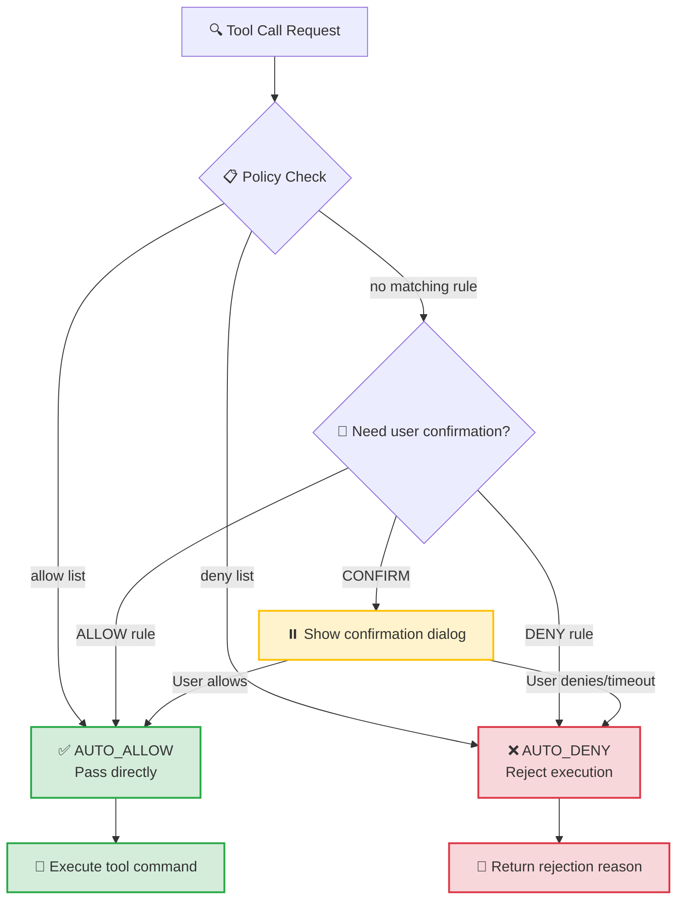

# Chapter 5: Permissions System — Enterprise Security Sandbox

**Code Location**: `src/openharness/permissions/` (3 files, 145 lines)

---

## 5.1 Why is a Permission System Necessary?

Agents have capabilities like file read/write and shell execution — this is a double-edged sword. Without control:

- 🚨 **Misoperation**: `rm -rf /`, `dd if=/dev/zero of=/dev/sda`
- 🚨 **Data leakage**: `cat ~/.ssh/id_rsa`, `ls ~/Documents/Company Secrets`
- 🚨 **Malicious injection**: Download and execute scripts, crypto mining, delete databases

OpenHarness adopts a **zero-trust model**: unspecified = denied. This is the first line of defense for enterprise customers.

---

## 5.2 Core Abstraction: PermissionDecision



```python
@dataclass
class PermissionDecision:
    allowed: bool               # Whether execution is permitted
    reason: str | None          # Rejection reason (user-facing, for education)
    requires_confirmation: bool # True = ask user again (medium-risk operation)
```

Three decision paths:

| allowed | requires_confirmation | Consequence |
|---------|----------------------|-------------|
| ✅ True | ❌ False | Execute immediately, no popup |
| ❌ False | ❌ False | **Immediate rejection** — high risk, no discussion |
| ❌ False | ✅ True | Popup asks user: "Confirm execution?" — medium risk, user can intervene |

---

## 5.3 PermissionChecker Evaluation Flow

```python
class PermissionChecker:
    def evaluate(
        self,
        tool_name: str,
        is_read_only: bool,
        file_path: str | None,
        command: str | None,
    ) -> PermissionDecision:
```

**5-step decision pipeline**:

```
Step 1: Mode check
    if mode == "disabled":
        return allowed=True

Step 2: Tool blacklist
    if tool_name in denied_tools:
        return denied(reason=f"Tool {tool_name} is disabled")

Step 3: Path whitelist (if allowed_paths configured)
    if file_path and not fnmatch(file_path, allowed_pattern):
        return requires_confirmation(reason=f"Path not in whitelist")

Step 4: Command blacklist (Bash only)
    if tool_name == "Bash" and command:
        for pattern in command_denylist:
            if re.search(pattern, command):
                return denied(reason=f"Command contains dangerous pattern: {pattern}")

Step 5: Write operations require confirmation by default
    if not is_read_only and tool_name in ("FileWrite", "FileEdit"):
        return requires_confirmation(reason="Write operation needs confirmation")

Step 6: Default allow
    return allowed=True
```

---

## 5.4 Configuration Example (permissions.yaml)

```yaml
# ~/.config/openharness/permissions.yaml
mode: "strict"  # strict | warn | disabled

# Path whitelist (supports wildcards)
allowed_paths:
  - "/Users/you/projects/**"
  - "/tmp/**"
  - "/var/log/**"

# Completely disabled tools
denied_tools:
  - "Bash"          # Disable shell execution
  # - "RemoteTrigger"  # Can also disable remote trigger

# Command deny regex list (Bash only)
command_denylist:
  - "rm -rf /"                # Recursive delete root
  - "> /dev/random"           # Fill device
  - "curl .* \| sh"           # Download script execution
  - "sudo"                    # Privilege escalation
  - "chmod [0-7]{3,}"         # Change permissions
```

---

## 5.5 Real-World Scenarios

### Scenario 1: Agent tries `rm -rf /`

```python
decision = permission_checker.evaluate(
    tool_name="Bash",
    is_read_only=False,
    file_path=None,
    command="rm -rf /tmp/oldfiles"
)
```

**Result**:
- `allowed=False`
- `requires_confirmation=False`
- `reason="Command contains blocked pattern: rm -rf /"`
- Agent receives ToolResult(is_error=True, content=reason)

---

### Scenario 2: Write file outside whitelist

```python
decision = permission_checker.evaluate(
    tool_name="FileWrite",
    is_read_only=False,
    file_path="/Users/other/secret.txt",  # not in allowed_paths
    command=None
)
```

**Result**:
- `allowed=False`
- `requires_confirmation=True`
- `reason="Access to /Users/other/secret.txt not allowed by allowed_paths"`
- Triggers `permission_prompt` callback, asks user to confirm

---

### Scenario 3: Read-only operation (safe)

```python
decision = permission_checker.evaluate(
    tool_name="FileRead",
    is_read_only=True,
    file_path="/etc/passwd",
    command=None
)
```

**Result**:
- `allowed=True` (even if path not whitelisted, read-only passes by default)
- Note: Enterprise environments should also whitelist `/etc` or disable FileRead

---

## 5.6 Comparison with OpenClaw Permission System

| Dimension | OpenHarness | OpenClaw |
|-----------|-------------|----------|
| **Config format** | YAML (permissions.yaml) | JSON (config file) |
| **Check layers** | 5 layers (mode→tool→path→command→write confirm) | 3 layers (whitelist→blacklist→ask) |
| **Confirmation** | Async callback `permission_prompt` | Sync popup (CLI) |
| **Reason feedback** | Every denial has readable reason string | Only allow/deny |
| **Command matching** | Regex (flexible) | Substring match (simple) |

**OpenHarness more granular**: Every denial has readable reason, helpful for debugging and user education.

---

## 5.7 Enterprise Deployment Recommendations

For enterprise customers, minimal privilege configuration:

```yaml
mode: "strict"

# Minimal whitelist, only project directories
allowed_paths:
  - "/opt/myapp/**"
  - "/var/log/myapp/**"

# Disable dangerous tools
denied_tools:
  - "Bash"
  - "RemoteTrigger"
  - "CronCreate"  # Unless scheduled tasks explicitly needed

# Dangerous command patterns (if Bash must be enabled)
command_denylist:
  - "sudo"
  - "chmod [0-7]{3,}"
  - "rm -rf"
  - "dd"
  - "curl .* \| sh"
  - "wget .* -O - \| bash"
```

**Three-layer Protection Summary**:

1. **Tool layer**: Disable Shell (most dangerous tool)
2. **Path layer**: Only project directories accessible
3. **Command layer**: Even with Bash, dangerous pattern regex interception

---

## 5.8 Permission Auditing (Hook Integration)

Implement permission audit logs via POST_TOOL_USE Hook:

```python
@hook_executor.register(HookEvent.POST_TOOL_USE)
async def log_permission(event: HookEvent):
    tool_name = event.data["tool_name"]
    result = event.data["tool_result"]
    if result.is_error and "not allowed" in result.output:
        logger.warning(f"Permission denial: {tool_name} - {result.output}")
```

---

**Chapter Summary**: 145 lines implement enterprise security sandbox. Five-step decision pipeline + three-tier modes (deny/confirm/allow) + detailed reason feedback, keeping Agent actions within safe boundaries.

Next Chapter: [Chapter 6: Memory System — CLAUDE.md + MEMORY.md + Auto-Compact Trio](06-memory-system.md)