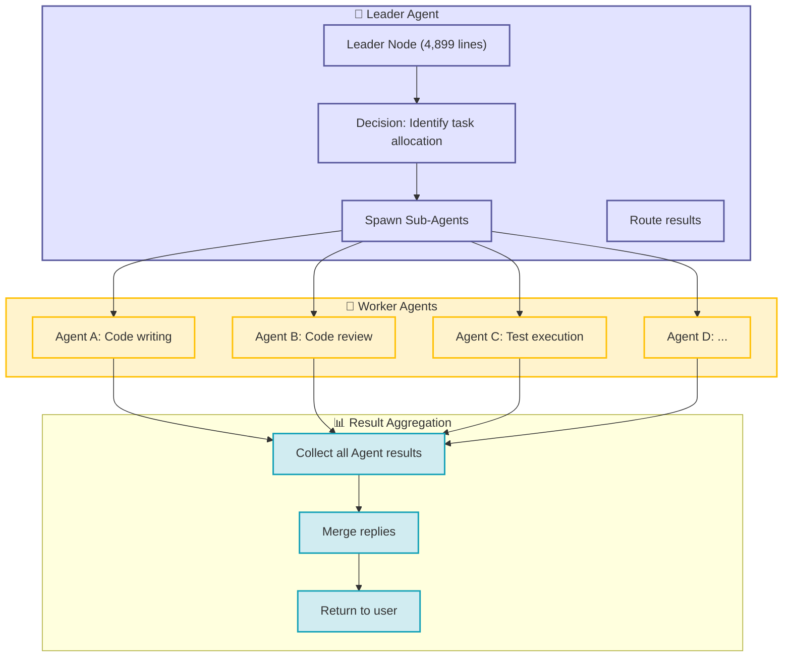

# Chapter 10: Swarm Cluster Coordination (4,899 Lines Deep Dive)

**Module**: `src/openharness/swarm/` (11 files, 4,899 lines)

---

## 10.1 What Problems Does Swarm Solve?

### Swarm Architecture Overview



When multiple Agents run simultaneously in a team:
1. **Resource contention**: Write files at same time? Execute Shell simultaneously?
2. **Permission isolation**: Workers need Leader approval for high-risk operations
3. **Message communication**: How do Agents broadcast, private chat?
4. **Persistence**: Team configuration, task state stored on disk (restartable)

---

## 10.2 Architecture Layers

```
┌─────────────────────────────────────────────┐
│            Coordinator (Definition Layer)    │
│  AgentDefinition + TeamRegistry (mem singleton) │
└─────────────────────────────────────────────┘
                      │  spawn
                      ▼
┌─────────────────────────────────────────────┐
│           Swarm (Execution Layer)           │
│  ├─ Backend (in_process / subprocess)      │
│  ├─ Lockfile (file lock)                   │
│  ├─ Mailbox (message mailbox)              │
│  ├─ PermissionSync (permission sync)      │
│  ├─ Worktree (workspace isolation)         │
│  └─ TeamLifecycle (team persistence)      │
└─────────────────────────────────────────────┘
```

---

## 10.3 Core Component Breakdown

### 10.3.1 TeamLifecycleManager (910 lines)

**Responsibility**: Team persistence storage, CRUD.

Team directory structure:

```
~/.openharness/teams/<teamName>/
├── team.json               # Team metadata (member list, config)
├── permissions/
│   ├── pending/            # Pending approval requests (worker → leader)
│   └── resolved/           # Approved results (leader → worker)
├── mailbox/                # One mailbox file per Agent
└── worktrees/              # worktree isolation directories (optional)
```

`team.json` example:

```json
{
  "name": "frontend-team",
  "description": "Frontend development team",
  "agents": ["ui-designer", "frontend-dev", "test-engineer"],
  "permissions": {
    "allowed_paths": ["/projects/frontend/**"],
    "denied_tools": ["Bash"]
  }
}
```

**Key operations**:
- `create_team(name, config)` → create directory + team.json
- `add_agent(team, agent_id)` → update agents list
- `list_teams()` → scan ~/.openharness/teams/*

---

### 10.3.2 PermissionSync (1168 lines, longest module)

In multi-process environment, Workers need Leader approval to execute high-risk tools (like Bash).

**Flow** (see file header docstring):

```
# File sync mode
1. Worker: write_permission_request(id, tool_name, payload) → pending/{id}.json
2. Leader: read_pending_permissions() → read all requests in pending/
3. Leader: resolve_permission(id, allowed=True/False) → move to resolved/{id}.json
4. Worker: poll_for_response(id) → poll until file appears
```

**API example**:

```python
# Worker side
request_id = permission_sync.write_permission_request(
    team="frontend-team",
    tool_name="Bash",
    payload={"command": "rm -rf /tmp/old"}
)
allowed = await permission_sync.poll_for_response("frontend-team", request_id, timeout=30)
```

```python
# Leader side (usually main Agent)
pending = permission_sync.read_pending_permissions("frontend-team")
for req in pending:
    # Check req.tool_name, req.payload
    if req.tool_name == "Bash" and "rm -rf" in req.payload["command"]:
        permission_sync.resolve_permission("frontend-team", req.id, allowed=False)
```

**Mailbox mode** (alternative to files):
- Use `TeammateMailbox` for IPC messaging (based on file lock + file polling)
- More real-time, suitable for long-running tasks

---

### 10.3.3 Mailbox (522 lines)

One mailbox file per Agent: `~/.openharness/teams/<team>/mailbox/<agent_id>.jsonl`

Message format:

```json
{
  "id": "uuid",
  "type": "permission_request | permission_response | custom",
  "from": "agent-id",
  "to": "leader-id" | "*" (broadcast),
  "payload": {...},
  "timestamp": 1775437281
}
```

**Send**:

```python
mailbox = TeammateMailbox(team="frontend-team", agent_id="worker-1")
await mailbox.send("leader", {
    "type": "permission_request",
    "tool_name": "Bash",
    "payload": {"command": "..."}
})
```

**Receive** (polling):

```python
async for msg in mailbox.receive():
    if msg.type == "permission_response":
        handle(msg.payload)
```

---

### 10.3.4 Worktree (315 lines)

Workspace isolation solution: each Agent runs in its own `git worktree`, sharing file history but with independent HEAD.

```python
worktree = Worktree.for_agent(team="frontend-team", agent_id="worker-1")
worktree_path = worktree.path  # /Users/.../teams/frontend-team/worktrees/worker-1

# Checkout branch, commit, merge...
worktree.checkout("feature-branch")
```

**Purpose**:
- Prevent Agents from overwriting each other's uncommitted changes
- Easy rollback (each worktree is full repo clone)

---

### 10.3.5 InProcess Backend (693 lines)

Simplest execution backend: run sub-Agent in same asyncio event loop.

```python
backend = InProcessBackend()
task_id = await backend.spawn(agent_id="reviewer", prompt="...", ...)
result = await backend.wait(task_id)
```

Advantages: No process startup overhead, good for lightweight tasks.
Disadvantages: One Agent crash may affect whole process.

---

### 10.3.6 Subprocess Backend (150 lines)

Strongest isolation: each Agent runs in independent subprocess.

```python
backend = SubprocessBackend()
proc = await backend.spawn(...)  # Start subprocess: python -m openharness ... --task-id xxx
# Communication: stdin/stdout JSON-RPC
await backend.send(task_id, message)
```

Suitable for: strict isolation, long-running, potentially crash-prone tasks.

---

### 10.3.7 Lockfile (73 lines)

File lock implementation (Unix `fcntl` + timeout retry):

```python
async with exclusive_file_lock(Path("/tmp/my-lock")):
    # Critical section: atomic file operations
    ...
```

Used for:
- mailbox write mutual exclusion
- permission pending move operations
- team.json updates

---

## 10.4 Data Flow: Complete Path of a Permission Request

**Scenario**: Worker Agent needs to execute `Bash("rm -rf ...")`

```
Worker:
  └─> permission_sync.write_permission_request()
          └─> write ~/.openharness/teams/frontend/pending/abc123.json

Leader (main Agent, background polling):
  └─> permission_sync.read_pending_permissions()
          └─> read pending/ list
  └─> decision (allow/deny)
  └─> permission_sync.resolve_permission("abc123", allowed=False)
          └─> move to resolved/abc123.json

Worker (poll again):
  └─> permission_sync.poll_for_response("abc123")
          └─> find resolved/abc123.json → return allowed=False
  └─> deny Bash execution, return ToolResult(is_error=True)
```

---

## 10.5 Comparison with OpenClaw Swarm

OpenClaw's `subagents` mechanism:
- Session-level isolation (sub-sessions)
- Message passing via `sessions_send`
- No built-in team, permission, worktree concepts

OpenHarness closer to "production-grade multi-Agent system":
- Persistent team definitions
- File-based permission sync (suitable for offline work)
- Worktree isolation (avoid file conflicts)
- Two backend options (in_process vs subprocess)

---

## 10.6 Design Highlights

1. **Multi-Backend support**: Can run in-process or subprocess, flexibly balance isolation vs performance
2. **Filesystem collaboration**: No external DB dependency, all state in `~/.openharness/teams/` files, easy backup/migration
3. **Permission sync dual modes**: Files (offline) + Mailbox (real-time), adapts to scenarios
4. **Worktree isolation**: Leverages git capabilities, lightweight containerization

---

## 10.7 Potential Issues

- **File lock reliability**: `fcntl` may have problems on NFS, suitable for single-machine only
- **Mailbox performance**: JSONL file polling, not efficient for high-frequency messages (but Agent scenarios typically not high-frequency)
- **No Leader election**: Currently assumes main Agent always online, manual recovery needed if crashes

---

Next Chapter: [Chapter 11: Channels Layer — 13 Platforms Implementation, Feishu 945 Lines Deep Dive](11-channels.md)