# Chapter 11: Channels Layer (13 Platforms, 5,183 Lines)

**Module**: `src/openharness/channels/` (18 files, 5,424 lines)

---

## 11.1 Channel Architecture Overview

```
channels/
├── base.py           : BaseChannel abstraction
├── bus/              : Message bus (OutboundMessage, Queue)
└── impl/
    ├── feishu.py     : 945 lines (Feishu + Lark)
    ├── mochat.py     : 897 lines (WeCom)
    ├── matrix.py     : 700 lines (Matrix)
    ├── telegram.py   : 509 lines
    ├── dingtalk.py   : 445 lines
    ├── email.py      : 410 lines
    ├── discord.py    : 313 lines
    ├── slack.py      : 281 lines
    └── ...           : Others
```

### Channel Matrix

```mermaid
flowchart LR
    subgraph BUS["📦 Message Bus (bus/)"]
        OM["OutboundMessage"]
        Q["MessageQueue"]
        DISP["dispatch()"]
    end
    subgraph BASE["🔌 BaseChannel Abstraction"]
        BC["parse_message()"]
        BS["send_message()"]
        GN["get_name()"]
    end
    subgraph IMPL["🏗️ 13 Platform Implementations"]
        F["Feishu 945 lines"]
        M["WeCom 897 lines"]
        MT["Matrix 700 lines"]
        T["Telegram 509 lines"]
        D["DingTalk 445 lines"]
        E["Email 410 lines"]
        S["Slack 310 lines"]
        O["6 other platforms"]
    end
    OM --> Q --> DISP --> BASE --> IMPL
    classDef bus fill:#e3f2fd,stroke:#1565c0,stroke-width:2px
    classDef impl fill:#fff3e0,stroke:#e65100,stroke-width:2px
    class BUS,BASE bus
    class IMPL impl
```



---

## 11.2 Unified Interface

```python
class BaseChannel(Protocol):
    async def start(self) -> None: ...
    async def stop(self) -> None: ...
    async def send(self, message: str, **kwargs) -> None: ...
    async def listen(self) -> AsyncIterator[ChannelEvent]: ...
```

All channels implement `listen()` method, converting external IM messages to internal `ChannelEvent` then feeding into Agent Loop.

---

## 11.3 Message Bus (MessageBus)

```python
class MessageBus:
    """Central message queue, intermediary between channel → Agent"""
    def __init__(self):
        self._queue: asyncio.Queue[ChannelEvent] = asyncio.Queue()

    async def publish(self, event: ChannelEvent):
        await self._queue.put(event)

    async def consume(self) -> AsyncIterator[ChannelEvent]:
        while True:
            yield await self._queue.get()
```

---

## 11.4 Feishu Implementation Deep Dive (945 lines)

### 11.4.1 SDK Choice

Uses ByteDance's `lark-oapi`, supports:
- WebSocket long connections (real-time event push)
- Comprehensive message types (text, image, file, interactive, share...)

---

### 11.4.2 Core Class

```python
class FeishuChannel(BaseChannel):
    def __init__(self, config: FeishuConfig, message_bus: MessageBus):
        self.config = config
        self.bus = message_bus
        self._client: lark.Client | None = None
        self._background_tasks: set[asyncio.Task] = set()
```

---

### 11.4.3 Startup Flow (`start()`)

```python
async def start(self):
    # 1. Initialize SDK
    self._client = lark.Client(
        app_id=self.config.app_id,
        app_secret=self.config.app_secret,
        enable_store_token=True,  # Auto-manage tenant_access_token
    )

    # 2. Start WebSocket event listener (background task)
    task = asyncio.create_task(self._event_loop())
    self._background_tasks.add(task)
    task.add_done_callback(self._background_tasks.discard)
```

---

### 11.4.4 Event Loop (`_event_loop()`)

```python
async def _event_loop(self):
    ws_client = self._client.ws_client()
    async for event in ws_client.iter_events():
        # Event types: im.message.received_v1, p2p.message.create, ...
        if event.type == "im.message.received_v1":
            await self._handle_message(event)
```

---

### 11.4.5 Message Parsing (`_handle_message()`)

Feishu message `content` is JSON string, need parse based on `msg_type`:

```python
def _parse_content(content: dict, msg_type: str) -> str:
    if msg_type == "text":
        return content.get("text", "")
    elif msg_type == "image":
        return "[Image]"
    elif msg_type == "file":
        return f"[File: {content.get('file_name')}]"
    elif msg_type == "interactive":
        return _extract_interactive_content(content)  # Extract card buttons, title
    elif msg_type == "share_chat":
        return f"[Shared group chat: {content.get('chat_id')}]"
    ...
```

---

### 11.4.6 Sending Messages (`send()`)

```python
async def send(self, message: str, chat_id: str, **kwargs):
    # Support @user, rich text cards
    if kwargs.get("mention_user_id"):
        message = f"<at user_id=\"{kwargs['mention_user_id']}\"></at> {message}"

    req = lark.im.MessageReq(
        receive_id_type="chat_id",
        receive_id=chat_id,
        msg_type="text",
        content=json.dumps({"text": message}),
    )
    resp = self._client.im.msg.send(req)
    if not resp.success:
        logger.error(f"Feishu send failed: {resp.msg}")
```

---

### 11.4.7 Error Handling & Reconnection

- WebSocket exceptions auto-reconnect (exponential backoff)
- `tenant_access_token` expiration auto-refresh (SDK built-in)
- Message send failures logged, don't block

---

## 11.5 WeCom Implementation (mochat.py: 897 lines)

WeCom lacks official WebSocket API, implementation more complex:

- Polling mode: periodic GET /getmsg?key=...
- Message deduplication: `msgid` cached for 24h
- File download: first `media_id` → then `/media/download`
- Bot reply: needs `chatid` and bot permission enabled

---

## 11.6 Channel Comparison Table

| Channel | Lines | API Type | Characteristics |
|---------|-------|----------|-----------------|
| Feishu | 945 | WebSocket | Real-time, full message types |
| WeCom | 897 | Polling | Needs polling, file download cumbersome |
| Matrix | 700 | WebSocket | Open protocol, decentralized |
| Telegram | 509 | WebSocket + Polling | Good localization, poor China availability |
| DingTalk | 445 | Webhook (HTTP) | Simple but rate limits |
| Email | 410 | IMAP/SMTP | Async, high latency |
| Discord | 313 | WebSocket | Foreign communities |
| Slack | 281 | WebSocket | Enterprise use, hard to access from China |

---

## 11.7 Steps to Add New Channel (Practical Guide)

Suppose adding **DingTalk** channel:

1. Create `src/openharness/channels/impl/dingtalk.py` (exists, reference)
2. Inherit `BaseChannel`, implement `start`, `stop`, `send`, `listen`
3. Register in `tools/channels/__init__.py`'s `create_default_channel_registry()`
4. Add config model `DingTalkConfig` sibling to `FeishuConfig` in `config/schemas.py`
5. Update `config/schema.py` add `dingtalk.accounts` sibling to `feishu.accounts`
6. Write tests: `tests/channels/test_dingtalk.py`

---

## 11.8 Comparison with OpenClaw Channels

OpenClaw's Feishu implementation in `feishu-im` npm package + `bot` directory, ~800 lines TS.

| Comparison | OpenHarness | OpenClaw |
|------------|-------------|----------|
| Protocol | WebSocket long connection | Webhook HTTP (webhooks.feishu.cn) |
| Message deduplication | Automatic (msg_id cache) | Event idempotent handling |
| File reception | Manual `/media/download` required | Auto-download to `/tmp` |
| Extensibility | Unified BaseChannel, easy new platforms | Need modify multiple modules |

**OpenHarness advantages**:
- Unified abstraction, clean code structure
- Message bus decouples channels from Engine

**OpenClaw advantages**:
- Webhook mode Serverless-friendly (no long connections)
- Auto file download (via feishu_im_bot_image)

---

Next Chapter: [Chapter 12: MCP Integration — 340 Lines Model Context Protocol Client](12-mcp-integration.md)