# Chapter 15: Full Comparison — OpenHarness vs OpenClaw vs Other Frameworks

---

## 15.1 Code Size & Structure Comparison

| Dimension | OpenHarness | OpenClaw | LangChain | AutoGPT |
|-----------|-------------|----------|-----------|---------|
| Total code | **26,666 lines** (194 files, Python) | ~50,000+ lines (TS/JS + Python) | 100,000+ lines | 15,000+ lines |
| Core loop | **666 lines** (clear) | ~1,500 lines (distributed) | Complex layers | ~2,000 lines |
| Tools | 2,542 lines (43 tools) | ~3,000 lines (~60 tools) | 200+ tools | ~100 tools |
| Permissions | 145 lines | ~300 lines | none | none |
| Persistent memory | 274 lines + 492 lines Compact | **OpenViking (~20k lines)** | Manual implementation | Limited |
| Channels | **5,183 lines (13 platforms)** | ~2,000 lines (Feishu + Telegram) | none | none |
| MCP integration | 340 lines | none | none | none |

**Conclusion**:
- OpenHarness single repo compact, clear module separation
- OpenClaw multi-repo architecture, more features (OpenViking), but higher understanding cost
- OpenHarness channel coverage broader (especially Chinese market)

---

## 15.2 Architecture Design Philosophy Comparison

```mermaid
xychart-beta
    title "OpenHarness vs OpenClaw Code Size Comparison (lines)"
    x-axis ["Core Loop", "Tools", "Permissions", "Memory", "Channels", "MCP", "Total"]
    y-axis "Lines" 0 --> 25000
    bar [666, 2542, 145, 766, 5183, 340, 26666]
    bar [1500, 3000, 300, 20000, 2000, 0, 50000]
```



**OpenHarness** (strictly layered, Pythonic):

```
Commands → Coordinator/Swarm → Engine → Tools+Hooks+Memory+Permissions → Channels/MCP/API
```

- **Characteristic**: Unidirectional dependencies, high layers unaware of low-level details
- **Advantage**: Easy to test, replace components

**OpenClaw** (plugin-based + event-driven):

```
Gateway → Agent Selector → Skills+Plugins+OpenViking → Channels
```

- **Characteristic**: Agent as plugin, hot-reload support
- **Advantage**: Flexible, runtime dynamic loading

**LangChain** (upstream developer focused):

- Provides massive tools but complex integration
- More like SDK, not ready-to-use product

---

## 15.3 Memory System Deep Comparison

| Feature | OpenHarness | OpenClaw |
|---------|-------------|----------|
| Long-term storage | MEMORY.md (YAML frontmatter) | **OpenViking vector store** (semantic search) |
| Context compression | Micro + Full (LLM summary) | OpenViking layered loading |
| Auto-injection | CLAUDE.md + MEMORY recent 5 entries | **AutoRecall vector retrieval (strongest)** |
| Reversibility | Summary loses detail | Raw files preserved, semantic retrieval available |
| Cost | LLM summary calls | Vector indexing storage + retrieval |

**OpenClaw wins**: OpenViking's semantic retrieval far exceeds simple summaries.

**OpenHarness advantage**: Simple, transparent, no external dependencies (pure files).

---

## 15.4 Security & Permissions Comparison

| Feature | OpenHarness | OpenClaw |
|---------|-------------|----------|
| Denial reason feedback | **reason string** (readable) | Only allowed/denied |
| Command detection | Regex (flexible) | Substring match |
| User confirmation | Async `permission_prompt` callback | Sync popup (CLI) |
| Config format | YAML (`permissions.yaml`) | JSON (`config`) |
| Three-tier model | ✅ Tool blacklist → Path whitelist → Command blacklist | ✅ Path whitelist + Command blacklist |

OpenHarness's reason feedback helps audit logging and user education.

---

## 15.5 Extension Mechanisms Comparison

**OpenHarness** (OOP/Pythonic):

```python
class MyTool(BaseTool):
    name = "MyTool"
    async def execute(self, args, ctx): ...
registry.register(MyTool())
```

**OpenClaw** (JSON skill-driven):

```json
{
  "tools": [{
    "name": "my_tool",
    "description": "...",
    "handler": "scripts.my_tool.handler"
  }]
}
```

**Plugins**: OpenHarness compatible with Anthropic Skills format; OpenClaw proprietary skill system, deeply integrated with OpenViking.

---

## 15.6 Channels & Localization Comparison

| Channel | OpenHarness | OpenClaw |
|---------|-------------|----------|
| Feishu | ✅ 945 lines (Webhook + API full-feature) | ✅ Deep integration (message/calendar/tasks/bitable/approval) |
| DingTalk | ✅ 445 lines | ❌ none |
| WeCom | ✅ 897 lines | ❌ none |
| Telegram | ✅ 509 lines | ✅ |
| Discord | ✅ 313 lines | ✅ |
| Slack | ✅ 281 lines | ✅ |
| Email | ✅ 410 lines | ❌ none |

**OpenHarness covers Chinese market better**: Native support for Feishu, DingTalk, WeCom.

---

## 15.7 Performance & Deployment Comparison

| Dimension | OpenHarness | OpenClaw |
|-----------|-------------|----------|
| Deployment complexity | Single Python venv (~30MB) | Node.js + Python + OpenViking (~500MB) |
| Memory usage | ~200-500MB (no vector store) | ~2-4GB (OpenViking + models) |
| Startup speed | Seconds | Tens of seconds (OpenViking loading) |
| Enterprise ready | 🟡 Medium (needs containerization) | 🟢 High (has Helm + monitoring) |

OpenClaw better for medium-large enterprises, OpenHarness for lightweight deployment.

---

## 15.8 Selection Recommendations

| Scenario | Recommended | Reason |
|----------|-------------|--------|
| Rapid prototype validation | OpenHarness | Fast deployment, no external deps |
| Full Chinese market channel coverage | OpenHarness | Feishu/DingTalk/WeCom native |
| Need long-term memory retrieval | OpenClaw | OpenViking vector store irreplaceable |
| Enterprise deployment (K8s) | OpenClaw | Helm chart + monitoring mature |
| Custom tool development | OpenHarness | OOP approach more Python-dev friendly |
| Align with Claude Code ecosystem | OpenHarness | Compatible Plugins format |

---

Next Chapter: [Chapter 16: Practical Deployment Guide — From Zero to Live](16-deployment-guide.md)