# 第2章：架构全景图与核心设计哲学

## 2.1 架构分层

```
┌─────────────────────────────────────────────────────────────┐
│                       用户层                                │
│   CLI (oh)  |  TUI (React + Ink)  |  API (REST/OpenAI)    │
└─────────────────────────────────────────────────────────────┘
                              │
┌─────────────────────────────────────────────────────────────┐
│                     Commands 层 (54 个命令)                 │
│  /help /plan /commit /resume /cron /agent ...             │
└─────────────────────────────────────────────────────────────┘
                              │
┌─────────────────────────────────────────────────────────────┐
│                    协调层 (Coordinator + Swarm)            │
│  • Agent 定义与生命周期管理 (975 行)                       │
│  • 多 Agent 团队组建 (4,899 行 swarm 模块)                │
│  • 子 Agent Spawn 与任务分发                             │
└─────────────────────────────────────────────────────────────┘
                              │
┌─────────────────────────────────────────────────────────────┐
│                    Agent Loop (Engine)                     │
│  • 查询循环: query → stream → tool-call → 循环 (666 行)  │
│  • 自动上下文压缩 (Auto-Compact)                          │
│  • 并行工具执行 (async gather)                           │
└─────────────────────────────────────────────────────────────┘
                              │
┌─────────────────────────────────────────────────────────────┐
│                    能力层                                   │
│  ├─ Tools 系统 (2,542 行, 43 工具)                        │
│  ├─ Skills 知识库 (按需加载 .md)                          │
│  ├─ Plugins 插件机制 (兼容 Anthropic)                     │
│  ├─ Hooks 生命周期 (Pre/Post Tool Use)                   │
│  └─ Memory 持久化 (MEMORY.md + CLAUDE.md)                │
└─────────────────────────────────────────────────────────────┘
                              │
┌─────────────────────────────────────────────────────────────┐
│                    渠道层 (Channels)                       │
│  • 飞书(945 行)、钉钉、企业微信、Telegram、Discord...     │
│  • IM 消息接收/发送统一抽象                               │
└─────────────────────────────────────────────────────────────┘
                              │
┌─────────────────────────────────────────────────────────────┐
│                    基础设施层                               │
│  • Permissions 沙箱与权限 (145 行)                        │
│  • Config 配置系统 (362 行)                               │
│  • Services: Cron 调度、LSP 支持、OAuth、压缩             │
│  • MCP 协议客户端 (340 行)                                │
└─────────────────────────────────────────────────────────────┘
                              │
┌─────────────────────────────────────────────────────────────┐
│                    模型与 API 层                           │
│  • OpenAI 兼容客户端 (342 行)                             │
│  • Copilot OAuth (244 行)                                 │
│  • 多提供商路由 (Anthropic, DashScope, Ollama...)        │
└─────────────────────────────────────────────────────────────┘
```

### 架构全景图（Mermaid）

```mermaid
flowchart TB
    subgraph USER["👤 用户层"]
        CLI["CLI (oh)"]
        TUI["TUI (React + Ink)"]
        API["REST API (OpenAI 兼容)"]
    end
    subgraph CMDS["📋 Commands 层 (54 个命令)"]
        C1["/help, /plan"]
        C2["/commit, /resume"]
        C3["/cron, /agent ..."]
    end
    subgraph COORD["🎯 协调层"]
        COORDINATOR["Coordinator (975 行)"]
        SWARM["Swarm 集群 (4,899 行)"]
        SPAWN["子 Agent Spawn & 分发"]
    end
    subgraph ENGINE["🔄 Agent Loop (666 行)"]
        QUERY["run_query()"]
        COMPACT["Auto-Compact"]
        PARALLEL["并行工具执行"]
    end
    subgraph CAPS["🧩 能力层"]
        TOOLS["Tools (43 工具)"]
        SKILLS["Skills 知识库"]
        PLUGINS["Plugins"]
        HOOKS["Hooks 生命周期"]
        MEMORY["Memory 持久化"]
    end
    subgraph CHAN["📡 渠道层 (13 平台, 5,183 行)"]
        F["飞书(945)"]
        D["钉钉(445)"]
        T["Telegram(509)"]
        O["其他10平台"]
    end
    subgraph INFRA["⚙️ 基础设施层"]
        PERM["Permissions 沙箱 (145 行)"]
        CFG["Config (362 行)"]
        SVC["Cron/LSP/OAuth/压缩"]
        MCP["MCP 协议 (340 行)"]
    end
    subgraph MODELS["🤖 模型与 API 层 (342 行)"]
        OAI["OpenAI 兼容客户端"]
        AUTH["Copilot OAuth (244 行)"]
        MULTI["多提供商路由"]
    end
    USER --> CMDS --> COORD --> ENGINE --> CAPS --> CHAN --> INFRA --> MODELS
    classDef layer fill:#f0f4ff,stroke:#3366cc,stroke-width:2px
    class USER,CMDS,COORD,ENGINE,CAPS,CHAN,INFRA,MODELS layer
```





**总数据**：26,666 行，194 文件，横跨 28 个子模块

---

## 2.2 设计哲学

### 核心原则一：模型提供智力，Harness 提供手、眼、记忆、边界

- **模型**：只负责推理和决策（LLM）
- **Harness**：提供工具访问、状态管理、安全沙箱、持久化存储
- **分离关注点**：模型策略可换（Claude↔GPT↔Kimi），框架能力不变

### 核心原则二：极简核心 + 可插拔扩展

- **核心循环**（engine/query.py）：仅 666 行，只说三件事：
  1. 调用 LLM
  2. 执行工具
  3. 重复直到无工具请求

- **工具系统**：43 个工具可独立加载、卸载，支持运行时注册
- **插件机制**：兼容 Skills（.md 知识库）和 Plugins（Claude Code 扩展格式）

### 核心原则三：企业级安全默认

- **权限模型**三级默认拒绝：
  1. 文件系统沙箱（可选白名单）
  2. Shell 命令拒绝列表（rm -rf / 等危险命令）
  3. 用户确认弹窗（permission_prompt 回调）

- **内存隔离**：每个 Agent 独立 cwd，默认不可跨路径

### 核心原则四：上下文管理是核心问题

- **CLAUSE.md 自动发现**：遍历 cwd 向上查找根目录的 CLAUDE.md 并注入
- **MEMORY.md 持久化**：跨会话记忆在本地文件
- **Auto-Compact**：接近上下文窗口时自动压缩历史（LLM 摘要）

---

## 2.3 数据流：一次用户查询的全链路

```
用户输入 "列出 src 目录并统计代码行"
    │
    ▼
[Commands] → 如果是 /plan 等命令走单独解析路径，否则进入 Agent Loop
    │
    ▼
[Engine.run_query]
    ├─ auto_compact_if_needed()  # 检查是否需要压缩上下文
    ├─ api_client.stream_message()  # 调用 LLM（流式）
    │    └─ 模型返回：{"text": "", "tool_uses": [{"name":"Bash","input":...}]}
    ├─ yield AssistantTextDelta("...")  # 流式输出
    └─ if tool_uses:
         ├─ permission_checker.evaluate()  # 权限检查
         ├─ tool_registry.get(tool_name).execute()  # 执行工具
         │    └─ 例如 Bash: subprocess.run(command, cwd=context.cwd)
         ├─ append ToolResultBlock 到 messages
         └─ 继续下一轮循环（最多 max_turns=200）
    │
    ▼
最终产出：AssistantTurnComplete + UsageSnapshot（token 统计）
```

---

## 2.4 关键技术决策点

### 1. 为什么用 asyncio 而不是线程池？

OpenHarness 工具调用网络 I/O 多（WebFetch、MCP、API 调用），asyncio 更适合：

```python
# engine/query.py:145
results = await asyncio.gather(*[_run(tc) for tc in tool_calls])
```

并行工具执行显著降低总时延。

### 2. 为什么选 React TUI 而不是 curses？

- **生态**：Ink + React 组件模式，前端开发者容易上手
- **UI 丰富**：支持动画、颜色、布局
- **可测试**：React 测试工具链成熟

但代价是需 Node.js 环境和额外的前端构建。

### 3. 为什么单独拆分 channels/impl？

IM 渠道差异大（钉钉、飞书 API 完全不同），但抽象接口一致：

```python
class Channel(Protocol):
    async def send(self, message: str, **kwargs): ...
    async def listen(self) -> AsyncIterator[ChannelEvent]: ...
```

便于未来扩展新平台。

---

## 2.5 与 OpenClaw 的对比（预告）

| 维度 | OpenHarness | OpenClaw |
|------|------------|----------|
| 核心循环 | Pure asyncio + generator (query.py) | Node.js Event Loop |
| 语言 | Python (26k 行) | TypeScript/Node (估计 ~50k+) |
| TUI | React/Terminal (Ink) | Web-based Control UI |
| 插件 | 标准化的技能 + 插件接口 | 自定义 skill 系统 |
| 渠道 | 8+ 平台（飞书等） | Feishu + Telegram (可扩展) |
| 安全 | 三层权限（文件/命令/确认） | 路径白名单 + 命令拒绝 |

**OpenClaw 优势**：
- OpenViking 深度集成（向量记忆）
- 更成熟的企业级部署方案
- Web 控制台更友好

**OpenHarness 优势**：
- 单一 Python 环境，无需 Node.js + Python 混用
- 学术项目，代码组织更清晰
- 对中国本土渠道（飞书、钉钉、企微）覆盖更全

---

本章总结：架构清晰、分层明确、扩展性强。接下来进入第三章：Engine 核心循环源码级解析。  
下一章我们将逐段分析 `engine/query.py` 的 666 行核心实现。
