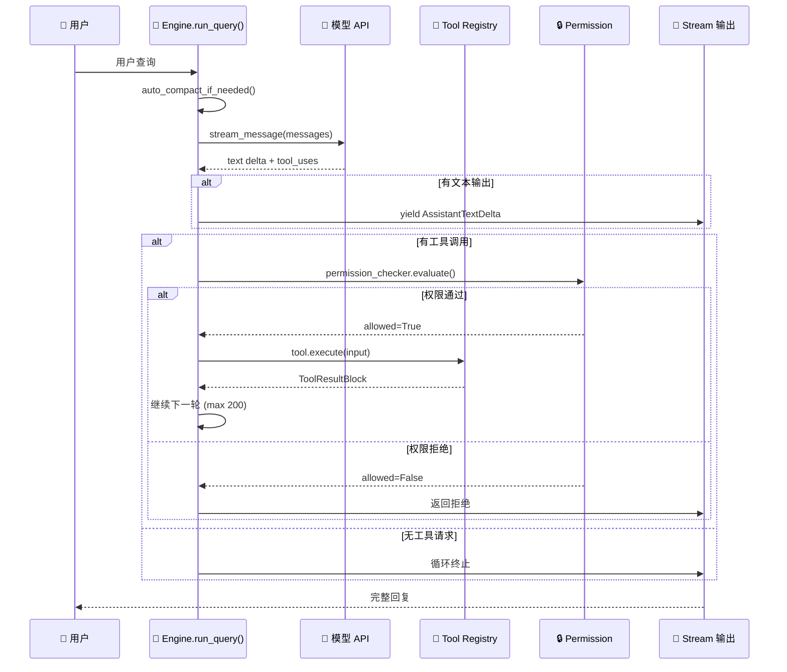

# 第3章：Engine 核心循环 —— 666 行的智慧

**核心文件**：`src/openharness/engine/query.py`（6 文件，666 行）

> 💡 **为什么核心循环只有 666 行？**
> 
> 因为 Agent 的本质很简单：问模型 → 执行工具 → 再问模型 → 循环。
> 
> 复杂的是工具、权限、记忆、渠道——不是循环本身。

---

## 3.1 入口函数：run_query

```python
async def run_query(
    context: QueryContext,
    messages: list[ConversationMessage],
) -> AsyncIterator[tuple[StreamEvent, UsageSnapshot | None]]:
```

### 参数解析

| 参数 | 类型 | 含义 |
|------|------|------|
| `context` | QueryContext | 运行上下文，装着以下所有依赖 |
| `messages` | list[ConversationMessage] | 对话历史（用户输入 + 助手回复 + 工具结果）|
| 返回值 | AsyncIterator | 异步流——每个事件即时产出，前端可实时更新 |

### QueryContext 里都有什么？

| 字段 | 作用 |
|------|------|
| `api_client` | 模型接口（调 LLM） |
| `tool_registry` | 工具注册表（找工具） |
| `permission_checker` | 权限检查器（审资格） |
| `hook_executor` | Hook 执行器（拦截器） |
| `cwd` | 工作目录（文件路径隔离） |
| `max_turns` | 最大轮数（默认 200） |

---

## 3.2 循环主干（伪代码，180 行核心逻辑）



这是全书最关键的部分，理解了它，整个框架就通了：

```
for turn in range(max_turns):  # 最多 200 轮
    │
    ├── Step 1: 检查上下文是否快满了
    │   auto_compact_if_needed()
    │   → 超过模型窗口 80%？压缩旧消息
    │
    ├── Step 2: 调用 LLM（流式输出）
    │   async for event in api_client.stream_message(messages):
    │       yield AssistantTextDelta("每个字")  ← 前端实时显示
    │   最终拿到 final_message（含文本 + tool_uses）
    │
    ├── Step 3: 模型还需要调工具吗？
    │   if not final_message.tool_uses:
    │       return  ← 不了，对话结束
    │
    ├── Step 4: 执行工具
    │   if 只有 1 个工具:
    │       result = await execute_tool()  ← 串行
    │   else:
    │       results = await asyncio.gather(...)  ← 并行！⚡
    │
    └── Step 5: 把工具结果追加到 messages，进入下一轮
        messages.append(ToolResultBlock(...))
    
raise MaxTurnsExceeded("超过 200 轮")
```

### 设计亮点

**① 并行执行**——模型同时调用 3 个工具时，不是串行等，而是 `asyncio.gather` 一起跑：

```python
results = await asyncio.gather(*[_run(tc) for tc in tool_calls])
```

> 举例：Agent 同时读文件、搜索网页、查数据库 → 三个 I/O 并行 → 总耗时 = 最慢那个，而不是三者之和。

**② 流式输出**——不是等全部生成完才返回，而是一边生成一边 yield：

```python
async for event in api_client.stream_message(...):
    yield AssistantTextDelta(event.text_delta)
```

> 用户体验：文字一个个蹦出来，像 ChatGPT 一样。不是等 10 秒后一次性显示。

**③ 自动压缩**——对话快把上下文窗口撑爆时，自动压缩旧消息：

```python
messages, compacted = await auto_compact_if_needed(messages, context)
```

---

## 3.3 权限检查：每个工具都过安检

工具执行前，**每个 tool_use 都过一遍权限检查**（不是只检查一次）：

```python
# engine/query.py Line ~200
decision = context.permission_checker.evaluate(
    tool_name=tool_name,
    is_read_only=tool.is_read_only,
    file_path=input.get("path"),
    command=input.get("command"),
)

if not decision.allowed:
    return ToolResultBlock(content=decision.reason, is_error=True)

if decision.requires_confirmation:
    confirmed = await context.permission_prompt(decision.reason)
    if not confirmed:
        return ToolResultBlock(content="用户拒绝了此操作", is_error=True)
```

决策树：

```
permission_checker.evaluate()
    │
    ├── allowed=True → 直接执行
    │
    ├── allowed=False, requires_confirmation=False → 直接拒绝 ❌
    │
    └── allowed=False, requires_confirmation=True → 弹窗问用户
            ├── 用户确认 → 执行
            └── 用户拒绝 → ToolResultBlock(is_error=True)
```

详细权限逻辑见 [第5章 权限系统](05-permissions.md)。

---

## 3.4 Hooks 钩子：工具执行前后的拦截器

```python
# 工具执行前
if context.hook_executor:
    pre_hooks = await context.hook_executor.execute(
        HookEvent.PRE_TOOL_USE,
        {"tool_name": tool_name, "tool_input": tool_input, ...}
    )
    if pre_hooks.blocked:
        return ToolResultBlock(content=pre_hooks.reason, is_error=True)

# → 执行工具 ←

# 工具执行后
if context.hook_executor:
    await context.hook_executor.execute(
        HookEvent.POST_TOOL_USE,
        {"tool_name": tool_name, "tool_result": result, ...}
    )
```

**企业用途**：

| 钩子点 | 可以做什么 |
|--------|-----------|
| PRE_TOOL_USE | 审计日志、速率限制、额外审批 |
| POST_TOOL_USE | 指标收集、结果验证、触发下游流程 |

---

## 3.5 自动上下文压缩（Auto-Compact）

对话太长怎么办？两种策略：

| 策略 | 做法 | LLM 调用 | 成本 |
|------|------|---------|------|
| **Micro-Compact** | 清除旧 tool_result 内容，替换为占位符文本 | ❌ 不需要 | 零 |
| **Full Compact** | 调 LLM 生成"这段对话摘要"，替换旧消息列表 | ✅ 需要 | 几 cents |

**触发条件**：

```python
if estimated_tokens > model_context_window * 0.8:
    # 超过窗口 80% → 开始压缩
```

**安全保护**：
- 只清除 tool_result 内容，不丢对话意图
- 始终保留最近 5 条完整消息（防丢失关键上下文）
- Full Compact 时可以用小模型（省钱）

### Token 怎么估算的？

```python
def estimate_tokens(text: str) -> int:
    return len(text) // 4 * 1.33  # 字符数 / 4，加 33% 缓冲
```

粗糙但够用——精确 tokenizer 太慢，没必要。

---

## 3.6 异常处理与边界情况

| 场景 | 行为 |
|------|------|
| 模型返回空回复 | 继续下一轮（不报错） |
| 工具执行抛异常 | ToolResultBlock(is_error=True) → 告诉模型 |
| 超过 max_turns | raise MaxTurnsExceeded → 整个查询失败 |
| 网络超时 | 重试或返回错误，取决于 api_client 实现 |
| 权限拒绝 | ToolResultBlock → 模型知道"被拒绝了" |

**关键设计**：工具错误不中断循环，而是转成 ToolResultBlock 告诉模型。模型可以自己调整策略，再试一次。

---

## 3.7 与 OpenClaw 的 Engine 对比

| 对比项 | OpenHarness | OpenClaw |
|--------|------------|----------|
| **循环结构** | Python async generator（yield 事件流） | Node.js stream + async/await |
| **上下文压缩** | 双级策略（micro + full） | OpenViking 向量召回压缩 |
| **并行工具** | `asyncio.gather`（原生） | `Promise.all`（类似） |
| **Hook 点** | PRE/POST_TOOL_USE | preTool / postTool |
| **代码量** | **666 行**（集中在 query.py） | 预估 1.5K+ 行（更分散） |
| **错误处理** | ToolResultBlock(is_error=True) → 模型自适应 | 类似，但更依赖 gateway 层 |

**OpenHarness 优势**：
- 代码更紧凑，决策逻辑一目了然
- Python generator 写流式循环天然优雅

**OpenClaw 优势**：
- OpenViking 向量压缩更智能（语义级压缩，不是简单摘要）
- Node.js 生态工具更丰富（GitHub Copilot Native 等）

---

## 3.8 源码阅读路线图

想自己读一遍代码？按这个顺序：

```
1. query.py 中的 StreamEvent 及其子类
   → AssistantTextDelta, ToolUseStart, ToolResult, AssistantTurnComplete

2. QueryContext 的定义
   → 看看它装了什么依赖

3. run_query() 主干
   → for 循环那 180 行

4. _execute_tool_call() 函数
   → 权限 → Hook → 执行 → 结果封装

5. services/compact/ 里的两种压缩策略
   → micro vs full，触发逻辑
```

---

> **上一章**：[第2章 架构全景图](02-architecture.md)  
> **下一章**：[第4章 Tools 工具系统 —— 43 种工具的注册、分发与执行](04-tools-system.md)
