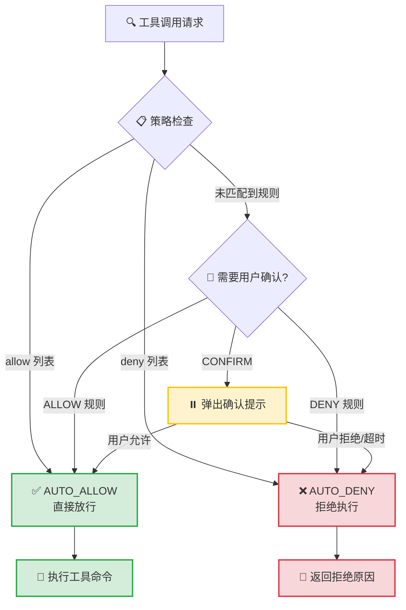

# 第5章：Permissions 权限系统 —— 企业级安全沙箱

**代码位置**：`src/openharness/permissions/`（3 文件，145 行）

---

## 5.1 为什么权限系统是必须的？

Agent 拥有文件读写、Shell 执行 capabilities —— 这是双刃剑。没有管控：

- 🚨 **误操作**：`rm -rf /`、`dd if=/dev/zero of=/dev/sda`
- 🚨 **数据泄露**：`cat ~/.ssh/id_rsa`、`ls ~/Documents/公司机密`
- 🚨 **恶意注入**：下载脚本并执行、挖矿、删库跑路

OpenHarness 采用 **零信任模型**：未明确允许 = 拒绝。这是企业客户的第一道防线。

---

## 5.2 核心抽象：PermissionDecision


```python
@dataclass
class PermissionDecision:
    allowed: bool               # 是否允许执行
    reason: str | None          # 拒绝原因（给用户看，用于教育）
    requires_confirmation: bool # True = 再问一次用户（中风险操作）
```

三种决策路径：

| allowed | requires_confirmation | 后果 |
|---------|----------------------|------|
| ✅ True | ❌ False | 直接执行，无弹窗 |
| ❌ False | ❌ False | **立即拒绝** —— 高风险，不容商量 |
| ❌ False | ✅ True | 弹窗问用户："确认要执行吗？" —— 中风险，用户可干预 |

---

## 5.3 PermissionChecker 检查流程

```python
class PermissionChecker:
    def evaluate(
        self,
        tool_name: str,
        is_read_only: bool,
        file_path: str | None,
        command: str | None,
    ) -> PermissionDecision:
```

**5 步决策管线**：

```
Step 1: 模式检查
    if mode == "disabled":
        return allowed=True

Step 2: 工具黑名单
    if tool_name in denied_tools:
        return denied(原因=f"工具 {tool_name} 已被禁用")

Step 3: 路径白名单（如果配置了 allowed_paths）
    if file_path and not fnmatch(file_path, allowed_pattern):
        return requires_confirmation(原因=f"路径不在白名单")

Step 4: 命令黑名单（仅 Bash）
    if tool_name == "Bash" and command:
        for pattern in command_denylist:
            if re.search(pattern, command):
                return denied(原因=f"命令含危险模式: {pattern}")

Step 5: 写操作默认加确认
    if not is_read_only and tool_name in ("FileWrite", "FileEdit"):
        return requires_confirmation(原因="写操作需确认")

Step 6: 默认允许
    return allowed=True
```

---

## 5.4 配置文件示例（permissions.yaml）

```yaml
# ~/.config/openharness/permissions.yaml
mode: "strict"  # strict | warn | disabled

# 路径白名单（支持通配符）
allowed_paths:
  - "/Users/you/projects/**"
  - "/tmp/**"
  - "/var/log/**"

# 完全禁用的工具
denied_tools:
  - "Bash"          # 禁用 Shell 执行
  # - "RemoteTrigger"  # 也可禁用远程触发

# 命令拒绝正则列表（仅 Bash）
command_denylist:
  - "rm -rf /"                # 递归删根
  - "> /dev/random"           # 填充设备
  - "curl .* \| sh"           # 下载脚本执行
  - "sudo"                    # 提权
  - "chmod [0-7]{3,}"         # 改权限
```

---

## 5.5 实际场景验证

### 场景 1：Agent 尝试 `rm -rf /`

```python
decision = permission_checker.evaluate(
    tool_name="Bash",
    is_read_only=False,
    file_path=None,
    command="rm -rf /tmp/oldfiles"
)
```

**结果**：
- `allowed=False`
- `requires_confirmation=False`
- `reason="Command contains blocked pattern: rm -rf /"`
- Agent 会收到 ToolResult(is_error=True, content=reason)

---

### 场景 2：写文件到白名单外

```python
decision = permission_checker.evaluate(
    tool_name="FileWrite",
    is_read_only=False,
    file_path="/Users/other/secret.txt",  # 不在 allowed_paths
    command=None
)
```

**结果**：
- `allowed=False`
- `requires_confirmation=True`
- `reason="Access to /Users/other/secret.txt not allowed by allowed_paths"`
- 触发 `permission_prompt` 回调，问用户是否确认

---

### 场景 3：只读操作（安全）

```python
decision = permission_checker.evaluate(
    tool_name="FileRead",
    is_read_only=True,
    file_path="/etc/passwd",
    command=None
)
```

**结果**：
- `allowed=True`（即使路径不在白名单，只读操作默认通过）
- 提示：企业环境建议也把 `/etc` 加入白名单或禁用 FileRead

---

## 5.6 与 OpenClaw 权限系统对比

| 维度 | OpenHarness | OpenClaw |
|------|------------|----------|
| **配置格式** | YAML（permissions.yaml） | JSON（config 文件） |
| **检查层级** | 5 层（模式→工具→路径→命令→写确认） | 3 层（白名单→黑名单→询问） |
| **确认机制** | 异步回调 `permission_prompt` | 同步弹窗（CLI） |
| **原因反馈** | 每条拒绝有详细 reason 字符串 | 只有允许/拒绝 |
| **命令匹配** | 正则表达式（灵活） | 子串匹配（简单） |

**OpenHarness 更精细**：每条拒绝都有可读原因，对调试和用户教育都有帮助。

---

## 5.7 企业部署建议

对于企业客户，推荐最小权限配置：

```yaml
mode: "strict"

# 最小白名单，只给项目目录
allowed_paths:
  - "/opt/myapp/**"
  - "/var/log/myapp/**"

# 禁用危险工具
denied_tools:
  - "Bash"
  - "RemoteTrigger"
  - "CronCreate"  # 除非明确需要定时任务

# 危险命令模式（如果 Bash 必须启用）
command_denylist:
  - "sudo"
  - "chmod [0-7]{3,}"
  - "rm -rf"
  - "dd"
  - "curl .* \| sh"
  - "wget .* -O - \| bash"
```

**三层防护 Summary**：

1. **工具层**：禁用 Shell（最危险工具）
2. **路径层**：只有项目目录可访问
3. **命令层**：即使有 Bash，危险模式正则拦截

---

## 5.8 权限审计（Hook 集成）

通过 POST_TOOL_USE Hook 实现权限审计日志：

```python
@hook_executor.register(HookEvent.POST_TOOL_USE)
async def log_permission(event: HookEvent):
    tool_name = event.data["tool_name"]
    result = event.data["tool_result"]
    if result.is_error and "not allowed" in result.output:
        logger.warning(f"权限拒绝: {tool_name} - {result.output}")
```

---

第5章总结：145 行代码实现了企业级安全沙箱。五步决策管线 + 三级模式（拒绝/确认/允许）+ 详细原因反馈，让 Agent 在安全边界内行动。

下一章：[第6章 Memory 系统 —— CLAUDE.md + MEMORY.md + Auto-Compact 三件套](06-memory-system.md)
