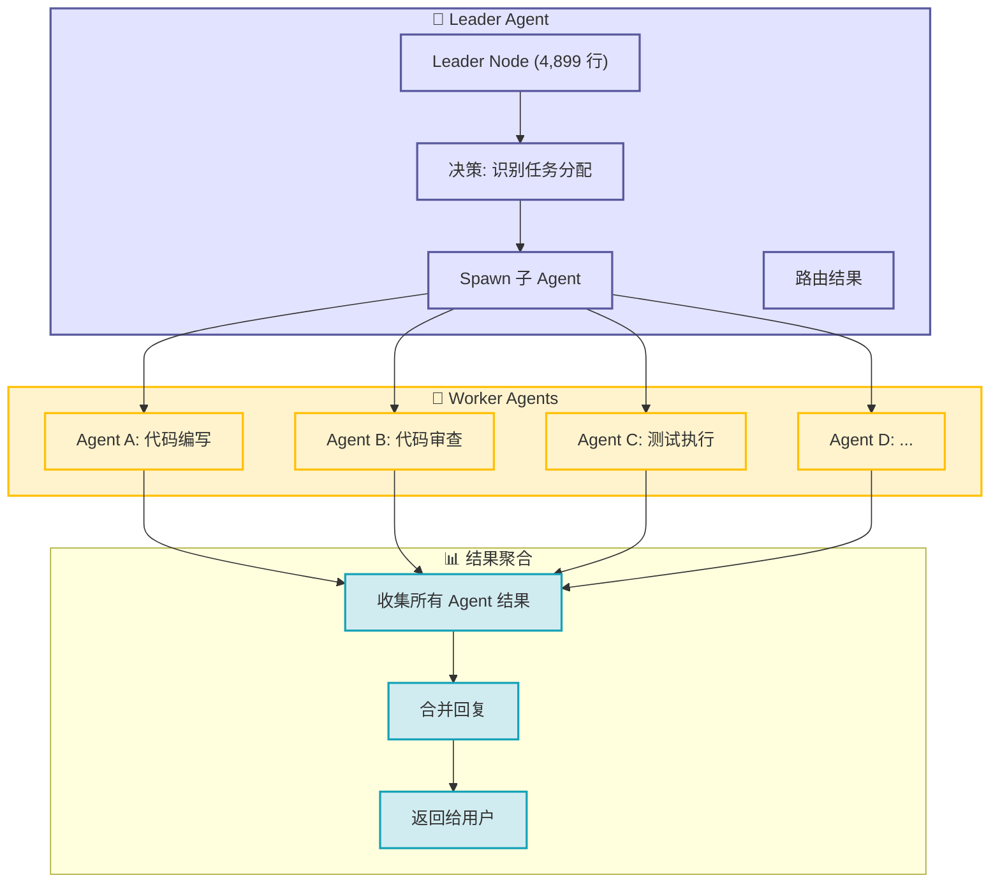

# 第10章：Swarm 集群协调（4,899 行深度解析）

**模块**：`src/openharness/swarm/`（11 文件，4,899 行）

---

## 10.1 Swarm 要解决什么问题？

### Swarm 架构总览





当多个 Agent 同时运行在一个团队中：
1. **资源竞争**：同时写文件？同时执行 Shell？
2. **权限隔离**：Worker 需要 Leader 授权高危操作
3. **消息通信**：Agent 之间如何广播、私聊？
4. **持久化**：团队配置、任务状态存磁盘（重启可恢复）

---

## 10.2 架构分层

```
┌─────────────────────────────────────────────┐
│              Coordinator (定义层)             │
│  AgentDefinition + TeamRegistry  (内存单例)  │
└─────────────────────────────────────────────┘
                      │  spawn
                      ▼
┌─────────────────────────────────────────────┐
│           Swarm (执行层)                      │
│  ├─ Backend (in_process / subprocess)       │
│  ├─ Lockfile (文件锁)                       │
│  ├─ Mailbox (消息邮箱)                      │
│  ├─ PermissionSync (权限同步)               │
│  ├─ Worktree (工作区隔离)                   │
│  └─ TeamLifecycle (团队持久化)              │
└─────────────────────────────────────────────┘
```

---

## 10.3 核心组件详解

### 10.3.1 TeamLifecycleManager（910 行）

**职责**：团队的持久化存储、CRUD。

团队目录结构：

```
~/.openharness/teams/<teamName>/
├── team.json               # 团队元数据（成员列表、配置）
├── permissions/
│   ├── pending/            # 待审批权限请求（worker → leader）
│   └── resolved/           # 已审批结果（leader → worker）
├── mailbox/                # 每个 Agent 一个邮箱文件
└── worktrees/              # worktree 隔离目录（可选）
```

`team.json` 示例：

```json
{
  "name": "frontend-team",
  "description": "前端开发团队",
  "agents": ["ui-designer", "frontend-dev", "test-engineer"],
  "permissions": {
    "allowed_paths": ["/projects/frontend/**"],
    "denied_tools": ["Bash"]
  }
}
```

**关键操作**：
- `create_team(name, config)` → 创建目录 + team.json
- `add_agent(team, agent_id)` → 更新 agents 列表
- `list_teams()` → 扫描 ~/.openharness/teams/*

---

### 10.3.2 PermissionSync（1168 行，最长模块）

多进程环境下，Worker 需要执行高危工具（如 Bash）时，需要 Leader 审批。

**流程**（见文件头 docstring）：

```
# 文件同步模式
1. Worker: write_permission_request(id, tool_name, payload) → pending/{id}.json
2. Leader: read_pending_permissions() → 读取 pending/ 下所有请求
3. Leader: resolve_permission(id, allowed=True/False) → 移至 resolved/{id}.json
4. Worker: poll_for_response(id) → 轮询直到文件出现
```

**API 示例**：

```python
# Worker 侧
request_id = permission_sync.write_permission_request(
    team="frontend-team",
    tool_name="Bash",
    payload={"command": "rm -rf /tmp/old"}
)
allowed = await permission_sync.poll_for_response("frontend-team", request_id, timeout=30)
```

```python
# Leader 侧（通常是主 Agent）
pending = permission_sync.read_pending_permissions("frontend-team")
for req in pending:
    # 检查 req.tool_name, req.payload
    if req.tool_name == "Bash" and "rm -rf" in req.payload["command"]:
        permission_sync.resolve_permission("frontend-team", req.id, allowed=False)
```

**Mailbox 模式**（替代文件）：
- 通过 `TeammateMailbox` 发送 IPC 消息（基于文件锁 + 文件轮询）
- 更实时，适合长运行任务

---

### 10.3.3 Mailbox（522 行）

每个 Agent 一个邮箱文件：`~/.openharness/teams/<team>/mailbox/<agent_id>.jsonl`

消息格式：

```json
{
  "id": "uuid",
  "type": "permission_request | permission_response | custom",
  "from": "agent-id",
  "to": "leader-id" | "*" (广播),
  "payload": {...},
  "timestamp": 1775437281
}
```

**发送**：

```python
mailbox = TeammateMailbox(team="frontend-team", agent_id="worker-1")
await mailbox.send("leader", {
    "type": "permission_request",
    "tool_name": "Bash",
    "payload": {"command": "..."}
})
```

**接收**（轮询）：

```python
async for msg in mailbox.receive():
    if msg.type == "permission_response":
        handle(msg.payload)
```

---

### 10.3.4 Worktree（315 行）

工作区隔离方案：每个 Agent 运行在自己的 `git worktree` 中，共享文件历史但独立 HEAD。

```python
worktree = Worktree.for_agent(team="frontend-team", agent_id="worker-1")
worktree_path = worktree.path  # /Users/.../teams/frontend-team/worktrees/worker-1

# 切换分支、提交、合并...
worktree.checkout("feature-branch")
```

**用途**：
- 避免 Agent 间互相覆盖未提交的修改
- 便于回滚（每个 worktree 都是完整 repo clone）

---

### 10.3.5 InProcess Backend（693 行）

最简单的执行后端：直接在同一个 asyncio 事件循环中运行子 Agent。

```python
backend = InProcessBackend()
task_id = await backend.spawn(agent_id="reviewer", prompt="...", ...)
result = await backend.wait(task_id)
```

优势：无进程启动开销，适合轻量任务。  
劣势：一个 Agent 崩溃可能影响整个进程。

---

### 10.3.6 Subprocess Backend（150 行）

最强隔离：每个 Agent 在独立子进程中运行。

```python
backend = SubprocessBackend()
proc = await backend.spawn(...)  # 启动子进程：python -m openharness ... --task-id xxx
# 通信：stdin/stdout JSON-RPC
await backend.send(task_id, message)
```

适用：需要严格隔离、长运行、可能崩溃的任务。

---

### 10.3.7 Lockfile（73 行）

文件锁实现（Unix `fcntl` + 超时重试）：

```python
async with exclusive_file_lock(Path("/tmp/my-lock")):
    # 临界区：文件操作原子
    ...
```

用于：
- mailbox 写互斥
- permission pending 移动操作
- team.json 更新

---

## 10.4 数据流：一次权限请求的完整路径

**场景**：Worker Agent 需要执行 `Bash("rm -rf ...")`

```
Worker:
  └─> permission_sync.write_permission_request()
          └─> 写 ~/.openharness/teams/frontend/pending/abc123.json
          
Leader (主 Agent, 后台轮询):
  └─> permission_sync.read_pending_permissions()
          └─> 读取 pending/ 列表
  └─> 决策（允许/拒绝）
  └─> permission_sync.resolve_permission("abc123", allowed=False)
          └─> 移至 resolved/abc123.json

Worker (再次轮询):
  └─> permission_sync.poll_for_response("abc123")
          └─> 发现 resolved/abc123.json → 返回 allowed=False
  └─> 拒绝执行 Bash，返回 ToolResult(is_error=True)
```

---

## 10.5 与 OpenClaw 的 Swarm 对比

OpenClaw 的 `subagents` 机制：
- Session 级隔离（子会话）
- 消息传递通过 `sessions_send`
- 无内置团队、权限、worktree 概念

OpenHarness 更接近「生产级多 Agent 系统」：
- 持久化团队定义
- 文件级权限同步（适合离线工作）
- Worktree 隔离（避免文件冲突）
- 两种 backend 可选（in_process vs subprocess）

---

## 10.6 设计亮点

1. **多 Backend 支持**：可在进程内或子进程中运行，灵活权衡隔离性与性能
2. **文件系统协作**：不依赖外部 DB，所有状态在 `~/.openharness/teams/` 文件，易备份迁移
3. **权限同步双模式**：文件（离线） + mailbox（实时），适应不同场景
4. **Worktree 隔离**：复用 git 能力，轻量级容器化

---

## 10.7 潜在问题

- **文件锁可靠性**：`fcntl` 在 NFS 上可能有问题，适合单机
- **Mailbox 性能**：JSONL 文件轮询，高频消息不够高效（但 Agent 场景通常不高频）
- **无 Leader 选举**：当前假设主 Agent 永远在线，若崩溃需手动恢复

---

下一章：Channels 渠道层（5,183 行，13 个平台实现，飞书 945 行详解）
