# 第15章：与 OpenClaw 及其他框架全面对比

---

## 15.1 代码规模与结构对比

| 维度 | OpenHarness | OpenClaw | LangChain | AutoGPT |
|------|-------------|----------|-----------|---------|
| 总代码量 | **26,666 行**（194 文件，Python） | 估计 50,000+ 行（TS/JS + Python） | 100,000+ 行 | 15,000+ 行 |
| 核心循环 | **666 行**（清晰） | ~1,500 行（分散） | 复杂多层 | ~2,000 行 |
| Tools | 2,542 行（43 工具） | ~3,000 行（~60 工具） | 200+ 工具 | ~100 工具 |
| 权限系统 | 145 行 | ~300 行 | 无 | 无 |
| 持久记忆 | 274 行 + 492 行 Compact | **OpenViking (~20k 行)** | 需手动实现 | 有限 |
| 渠道 | **5,183 行（13 平台）** | ~2,000 行（Feishu + Telegram） | 无 | 无 |
| MCP 集成 | 340 行 | 无 | 无 | 无 |

**结论**：
- OpenHarness 单一仓库紧凑、模块划分清晰
- OpenClaw 多仓库架构，功能更多（OpenViking），但理解成本高
- OpenHarness 渠道覆盖更广（尤其中国市场）

---

## 15.2 架构设计哲学对比

```mermaid
xychart-beta
    title "OpenHarness vs OpenClaw 代码规模对比 (行数)"
    x-axis ["核心循环", "Tools", "权限", "记忆", "渠道", "MCP", "总代码"]
    y-axis "行数" 0 --> 25000
    bar [666, 2542, 145, 766, 5183, 340, 26666]
    bar [1500, 3000, 300, 20000, 2000, 0, 50000]
```


**OpenHarness**（严格分层，Pythonic）：

```
Commands → Coordinator/Swarm → Engine → Tools+Hooks+Memory+Permissions → Channels/MCP/API
```

- **特点**：单向依赖，高层不感知底层细节
- **优势**：易于测试、替换组件

**OpenClaw**（插件化+事件驱动）：

```
Gateway → Agent Selector → Skills+Plugins+OpenViking → Channels
```

- **特点**：Agent 即插件，hot-reload 支持
- **优势**：灵活，可运行时动态加载

**LangChain**（面向上游开发者）：

- 提供海量工具，但集成复杂度高
- 更像 SDK，不是开箱即用产品

---

## 15.3 记忆系统深度对比

| 特性 | OpenHarness | OpenClaw |
|------|-------------|----------|
| 长期记忆存储 | MEMORY.md（YAML frontmatter）| **OpenViking 向量库**（语义检索） |
| 上下文压缩 | Micro + Full（LLM 摘要）| OpenViking 分层加载 |
| 自动注入 | CLAUDE.md + MEMORY 最近 5 条 | **AutoRecall 向量召回（最强）** |
| 可逆性 | 摘要丢失细节 | 原始文件保留，可按语义找回 |
| 成本 | LLM 摘要调用 | 向量索引存储+检索 |

**OpenClaw 完胜**：OpenViking 的语义检索能力远超简单摘要。

**OpenHarness 优势**：简单、透明、无外部依赖（纯文件）。

---

## 15.4 安全与权限系统对比

| 特性 | OpenHarness | OpenClaw |
|------|-------------|----------|
| 拒绝原因反馈 | **reason 字符串**（可读） | 只有 allowed/denied |
| 命令检测 | 正则表达式（灵活） | 子串匹配 |
| 用户确认 | 异步 `permission_prompt` 回调 | 同步弹窗（CLI） |
| 配置格式 | YAML（`permissions.yaml`） | JSON（config） |
| 三层模型 | ✅ 工具黑名单 → 路径白名单 → 命令黑名单 | ✅ 路径白名单 + 命令黑名单 |

OpenHarness 的 reason 反馈对审计日志、用户教育都有帮助。

---

## 15.5 扩展机制对比

**OpenHarness**（OOP/Pythonic）：

```python
class MyTool(BaseTool):
    name = "MyTool"
    async def execute(self, args, ctx): ...
registry.register(MyTool())
```

**OpenClaw**（JSON 技能驱动）：

```json
{
  "tools": [{
    "name": "my_tool",
    "description": "...",
    "handler": "scripts.my_tool.handler"
  }]
}
```

**Plugins**：OpenHarness 兼容 Anthropic Skills 格式；OpenClaw 自有 skill 系统，与 OpenViking 深度集成。

---

## 15.6 渠道与本地化对比

| 渠道 | OpenHarness | OpenClaw |
|------|-------------|----------|
| 飞书 | ✅ 945 行（Webhook + API 全功能） | ✅ 深度集成（消息/日历/任务/多维/审批） |
| 钉钉 | ✅ 445 行 | ❌ 无 |
| 企业微信 | ✅ 897 行 | ❌ 无 |
| Telegram | ✅ 509 行 | ✅ |
| Discord | ✅ 313 行 | ✅ |
| Slack | ✅ 281 行 | ✅ |
| 邮件 | ✅ 410 行 | ❌ 无 |

**OpenHarness 对中国市场覆盖更全**：飞书、钉钉、企业微信都原生支持。

---

## 15.7 性能与部署对比

| 维度 | OpenHarness | OpenClaw |
|------|-------------|----------|
| 部署复杂度 | 单 Python venv（~30MB） | Node.js + Python + OpenViking（~500MB） |
| 内存占用 | ~200-500MB（无向量库） | ~2-4GB（OpenViking + 模型） |
| 启动速度 | 秒级 |  tens of seconds（OpenViking 加载） |
| 企业就绪 | 🟡 中（需要容器化） | 🟢 高（已有 Docker + Helm） |

OpenClaw 更适合中大型企业，OpenHarness 更适合轻量部署。

---

## 15.8 选型建议

| 场景 | 推荐框架 | 理由 |
|------|----------|------|
| 快速原型验证 | OpenHarness | 部署快、无外部依赖 |
| 中国市场渠道全覆盖 | OpenHarness | 飞书/钉钉/企微原生支持 |
| 需要长期记忆检索 | OpenClaw | OpenViking 向量库不可替代 |
| 企业级部署（K8s） | OpenClaw | Helm chart + 监控完善 |
| 自定义工具开发 | OpenHarness | OOP 方式更贴近 Python 开发者 |
| 与 Claude Code 生态对齐 | OpenHarness | 兼容 Plugins 格式 |

---

下一章：[第16章 实战部署指南 —— 从零到上线](16-deployment-guide.md)
